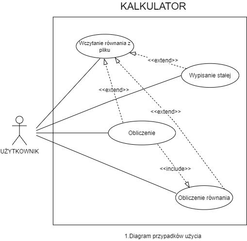

# Kalkulator

Kalkulator obliczający wartość wyrażenia algebraicznego. Obsługuje operacje takie jak:
+, -, \*, \\ , zmienne i przypisanie zmiennych np. "n = 4, wartosc = 4 * n - 3, wartosc". Obsługuje podstawowe stałe matematyczne. Kalkulator umożliwia także
wczytanie wyrażenia z pliku.

## Członkowie projektu
- Jan Lewandowski - 300560
- Jan Adamski - 300472
- Tomasz Kapuściński - 303976

## Użyte technolgie

- Java

## Opis słowny przypadków użycia

### 1. Obliczenie

Użytkownik ma możliwość wpisania w kalkulatorze odpowiedniego równania z dowolną ilością znaków lub zmiennych po ich wcześniejszym przypisaniu. Wyrażenie program obliczy uwzględniając kolejność wykonywania działań matematycznych.

np.
```bash
n = 4, wartosc = 4 * n - 3, wartosc
>>> 13
```

### 2. Wypisanie stałej

Użytkownik ma możliwość sprawdzenia wartości stałej używając wyrażenia '@nazwastałej':

np.
```bash
@pi
>>> 3.14159
@e
>>> 2.71828
```

### 3. Wczytanie równania z pliku

Jest również możliwość wczytania odpowiedniego wyrażenia z pliku txt.

np. dla pliku nazwa_pliku.txt:
```bash
n = 2.5, i = 10, i * n
```

```bash
!(sciezka_do_pliku/nazwa_pliku.txt)
>>> 25
```

### 4. Obliczenie równania

Użytkownik może wypisać wartość równania matematycznego bez deklarowania zmiennych.

np.

```bash
(4 + 4) * 2
>>> 16
```

## Diagram przypadków użycia



## Diagram klas


## Algorytmy

### 1. Sprawdzanie poprawności domknięcia nawiasów w równaniu
Algorytm przyjmuje ciąg samych nawiasów użytych w równaniu i sprawdza czy każdy
został poprawnie domknięty/otwarty. Wykorzystuje on metody klasy Stack push() oraz 
pop(), aby śledzić otwieranie i zamykanie nawiasów w napisie. Zwraca true jeśli
wszystkie nawiasy są poprawnie otwarte i zamknięte, w przeciwnym wypadku zwraca false.